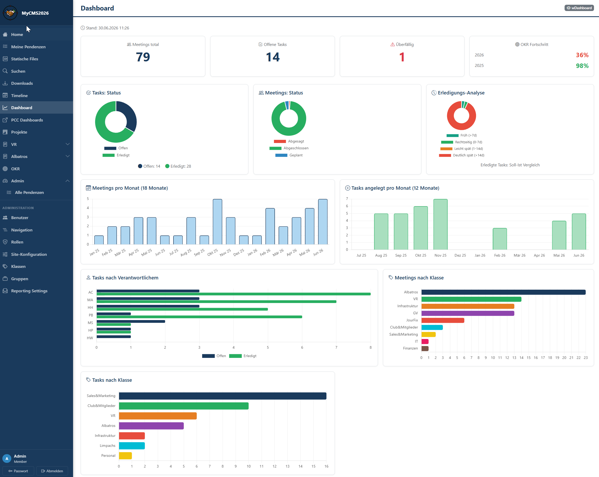

# MyCMS2026



Ein schlankes, self-hosted Content-Management- und Team-Workspace-System auf Basis von **ASP.NET Core 8 / Razor Pages**. MyCMS2026 kombiniert klassische CMS-Funktionen (verwaltbare HTML-Seiten, Navigation, Bild-Uploads) mit einem geschützten internen Arbeitsbereich für Meetings, Projekte, Aufgaben, OKRs und Dokumenten-Ablage.

Die Datenhaltung erfolgt **dateibasiert über JSON** – es wird keine Datenbank benötigt. Das macht das System leichtgewichtig, portabel und einfach zu deployen.

---

## Funktionsumfang

**Content & Öffentlichkeit**
- Verwaltbare HTML-Seiten mit Inline-Editor (`Admin/EditHtmlPage`)
- Konfigurierbare Navigation und Menüstruktur
- Bildverwaltung mit sicherem Upload (kein SVG – XSS-Schutz)
- Download-Bereich für Dateien

**Interner Arbeitsbereich (Login erforderlich)**
- **Meetings** – Timeline, Detailansichten, Datei-Anhänge
- **Projekte** – inkl. Journal mit Datei-Anhängen
- **Pendenzen** & **Todos** – Aufgabenverwaltung mit Anhängen
- **OKR** – Objectives & Key Results
- **Vault** – abgesicherte, kontextbezogene Dokumenten-Ablage
- **Dashboard** mit modularen Widgets

**Administration**
- Benutzer-, Rollen- und Gruppenverwaltung
- Klassen- und Kontext-basierte Sichtbarkeitssteuerung
- Site-Konfiguration inkl. Offline-Modus
- Activity-Log
- Automatischer wöchentlicher E-Mail-Versand (Background-Service)

**Sicherheit**
- Cookie-basierte Authentifizierung (7 Tage, Sliding Expiration)
- Passwort-Hashing mit **BCrypt**
- Rate-Limiting auf Login / Passwort-Reset (10 Requests/Minute pro IP)
- HTML-Sanitizing von Benutzer-Rich-Text (Schutz vor Stored XSS)
- `X-Robots-Tag: noindex, nofollow` + `robots.txt` Disallow – kein Suchmaschinen-Indexing
- Offline-Sperre für Nicht-Administratoren
- Setup-Assistent beim Erststart (kein Default-Admin im Code)

---

## Technologie-Stack

| Bereich        | Technologie                          |
|----------------|--------------------------------------|
| Framework      | ASP.NET Core 8 (Razor Pages)         |
| Sprache        | C# (Nullable + Implicit Usings)      |
| Datenhaltung   | JSON-Dateien in `App_Data/`          |
| Auth           | Cookie Authentication                |
| Passwörter     | BCrypt.Net-Next                      |
| E-Mail         | MailKit / MimeKit                    |
| HTML-Sicherheit| HtmlSanitizer (Ganss.Xss)            |
| Hosting        | IIS In-Process (ASP.NET Core Module)  |

---

## Voraussetzungen

- [.NET 8 SDK](https://dotnet.microsoft.com/download/dotnet/8.0)
- Optional: Visual Studio 2022 (v17+)

---

## Nur installieren statt bauen?

Wer MyCMS2026 nur betreiben und nicht selbst kompilieren möchte, nutzt das fertige Deployment-Repository:

**→ [mallemann/mycms2026-deploy-template](https://github.com/mallemann/mycms2026-deploy-template)** – eine leere, kompilierte MyCMS-Instanz. Beim Setup lassen sich bei Bedarf Demodaten mitinstallieren.

Dieses Repository hier (Quellcode) ist für Entwicklung, Anpassung und eigene Builds gedacht.

## Schnellstart (aus dem Quellcode)

```bash
# Repository klonen
git clone https://github.com/mallemann/MyCMS2026.git
cd MyCMS2026

# Abhängigkeiten wiederherstellen & starten
cd MyCMS2026
dotnet restore
dotnet run
```

Beim ersten Aufruf leitet die App automatisch auf `/Setup` weiter. Dort werden Site-Name, Basis-URL und der erste Administrator-Account angelegt. Optional lassen sich Demodaten (Gruppen, Klassen, Navigation, Rollen) laden. Nach Abschluss wird die Datei `App_Data/setup-complete` erstellt und der Setup-Bereich gesperrt.

---

## Konfiguration

Die Konfiguration erfolgt über die üblichen `appsettings`-Dateien:

- `appsettings.json` – Basiskonfiguration (im Repository enthalten, ohne Secrets)
- `appsettings.Development.json` – lokale Entwicklung *(nicht im Repository)*
- `appsettings.Production.json` – Produktionsumgebung  *(nicht im Repository)*


Optionaler `PathBase` (für Betrieb in einem Unterverzeichnis) kann per Konfigurationsschlüssel `PathBase` gesetzt werden.

---

## Projektstruktur

```
MyCMS2026/
├── MyCMS2026.sln
├── MyCMS2026/
│   ├── Program.cs              # Startup, Middleware, DI, Routing
│   ├── Pages/                  # Razor Pages (Account, Admin, Meetings,
│   │                           #   Projects, Todos, Pendenzen, Vault, OKR …)
│   │   ├── Shared/             # Layout
│   │   └── Widgets/            # Dashboard-Widgets
│   ├── Services/               # Fachlogik (User-, Meeting-, Project-,
│   │                           #   Vault-, WeeklyMail-Service …)
│   ├── Models/                 # Domänenmodelle
│   ├── Infrastructure/         # Page-Filter (Activity-Logging)
│   ├── App_Data/               # JSON-Datenhaltung + Uploads (Laufzeit)
│   │   └── demo/               # Demodaten für Setup
│   └── wwwroot/                # CSS, Icons, Manifest, robots.txt
```

---

## Datenhaltung

Alle Anwendungsdaten liegen als JSON-Dateien unter `App_Data/`. Laufzeitdaten (`App_Data/*.json`, Uploads, `setup-complete`) werden **nicht** ins Repository eingecheckt und beim Publish nicht mitkopiert – sie entstehen zur Laufzeit bzw. beim Setup. Für Backups genügt es, den Ordner `App_Data/` zu sichern.

---

## Deployment

```bash
dotnet publish -c Release
```

Beim Publish werden Laufzeitdaten und `appsettings.Production.json` bewusst ausgeschlossen (siehe `MyCMS2026.csproj`). Das Hosting-Modell ist **In-Process** (`AspNetCoreHostingModel = InProcess`): Unter IIS läuft die App direkt im Worker-Prozess (`w3wp.exe`) über das ASP.NET Core Module – ohne Reverse-Proxy-Hop, mit höherem Durchsatz und geringerer Ressourcen-Last. Voraussetzung ist ein **eigener App-Pool pro App** (bei InProcess ist nur eine App pro Pool zulässig); der App-Pool wird auf „No Managed Code" gesetzt. Die Einstellung wirkt nur unter IIS – bei reinem Kestrel-Hosting wird sie ignoriert. Die im Repo enthaltene `app_offline.htm` kann für Wartungsfenster genutzt werden.

---

## Sicherheitshinweise

- Keine Secrets im Repository – produktive Zugangsdaten gehören ausschließlich in die nicht getrackte `appsettings.Production.json`.
- Das System ist standardmäßig für **nicht-öffentliche / interne Nutzung** ausgelegt (kein Suchmaschinen-Indexing, Offline-Sperre, Setup-geschützt).
- Vor dem Produktivbetrieb: eigenen Administrator anlegen und ein starkes Passwort verwenden.

---

## Lizenz

Lizenziert unter der **[PolyForm Noncommercial License 1.0.0](LICENSE.md)**.

Kurz gesagt: Jeder darf MyCMS2026 frei nutzen, verändern und weitergeben – für **nicht-kommerzielle** Zwecke (Hobby, Studium, private Nutzung, gemeinnützige und öffentliche Organisationen). **Nicht erlaubt** ist die kommerzielle Verwertung, insbesondere das Weiterverkaufen der Software. Für kommerzielle Nutzung bitte den Autor kontaktieren.

Copyright © 2026 Martin Allemann
